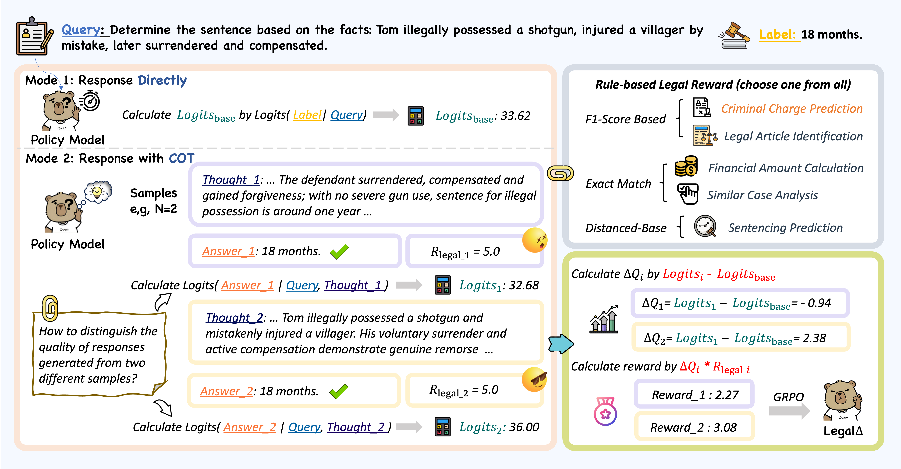

# Legal&Delta;: Enhancing Legal Reasoning in LLMs via Reinforcement Learning with Chain-of-Thought Guided Information Gain
Source code for our paper :  
[Legal&Delta;: Enhancing Legal Reasoning in LLMs via Reinforcement Learning with Chain-of-Thought Guided Information Gain](https://arxiv.org/abs/2508.12281)

Click the links below to view our papers, checkpoints:

<a href='https://arxiv.org/abs/2508.12281'></a><a href='https://huggingface.co/Xubqpanda/LegalDelta'></a>

If you find this work useful, please cite our paper and give us a shining star 🌟
```
@misc{dai2025legaldeltaenhancinglegalreasoning,
      title={Legal$\Delta$: Enhancing Legal Reasoning in LLMs via Reinforcement Learning with Chain-of-Thought Guided Information Gain}, 
      author={Xin Dai and Buqiang Xu and Zhenghao Liu and Yukun Yan and Huiyuan Xie and Xiaoyuan Yi and Shuo Wang and Ge Yu},
      year={2025},
      eprint={2508.12281},
      archivePrefix={arXiv},
      primaryClass={cs.CL},
      url={https://arxiv.org/abs/2508.12281}, 
}
```
## Overview

Legal&Delta; is a reinforcement learning framework designed to enhance legal reasoning through COT-guided information gain. During training, Legal&Delta; employs a dual-mode input setup—comprising direct answer and reasoning-augmented modes—and maximizes the information gain between them. This encourages the model to acquire meaningful reasoning patterns rather than generating superficial or redundant explanations.
Legal&Delta; follows a two-stage approach: (1) distilling latent reasoning capabilities from a powerful Large Reasoning Model (LRM), DeepSeek-R1, and (2) refining reasoning quality via differential comparisons, combined with a multidimensional reward mechanism that assesses both structural coherence and legal-domain specificity.
## Set Up
**Use `git clone` to download this project**
```
git clone https://github.com/NEUIR/LegalDelta.git
cd LegalDelta
```
**To prevent conflicts between packages, we mainly use two virtual environment management packages, one for model inference and one for model training.**

```
for model inference, please:
conda env create -n qwen_inf -f inference_environment.yml

for model training, please:
conda create -n legal_delta python=3.11
conda activate legal_delta
pip install -r requirements.txt --force-reinstall --no-deps --no-cache-dir
```

## Using Legal&Delta; model
**(1) Use `git clone` to download the model:**
❗️Note: These are lora checkpoints of legal models, please merge it before use.
```
git clone https://huggingface.co/Xubqpanda/LegalDelta;
```
**(2) Evaluating**
For different tasks, you need to use different metrics for evaluating.

```
for Lawbench, please:
bash scripts/eval_lawbench.sh
```

for Lexeval, please visit [here](https://github.com/CSHaitao/LexEval)

for Disclaw, please visit [here](https://github.com/FudanDISC/DISC-LawLLM)


### Training the model
**After constructing the training data, you can start training the Legal&Delta; model.**

(1) First step: You need to download [Qwen2.5-14B-Instruct](https://huggingface.co/Qwen/Qwen2.5-14B-Instruct) model as  Zero-shot Model.

(2) Second step: use lora to train the model
```
conda activate legal_delta
bash scripts/train.sh
```

(3) Third step: Select the checkpoint with the lowest eval loss, and combine the weights of the Legal&Delta; model trained using lora in Second step.
```
python src/merge_lora.py
```


## Contact
If you have questions, suggestions, and bug reports, please email:
```
daix1@mails.neu.edu.cn
```